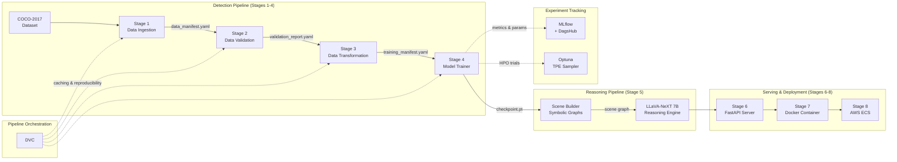

<div align="center">

# VisionLLM InteractionAnalysis

**End-to-end vision + LLM reasoning for child–caregiver interaction analysis**

[](https://www.python.org)
[](https://pytorch.org)
[](https://docs.pydantic.dev)
[](https://fastapi.tiangolo.com)
[](https://dvc.org)
[](https://mlflow.org)
[](https://hub.docker.com)
[](https://github.com/features/actions)
[](LICENSE)
[](https://cocodataset.org)
[](https://dagshub.com/arunps12/VisionLLM_InteractionAnalysis)

</div>

---

## Table of Contents

- [Overview](#overview)
- [Architecture](#architecture)
- [Pipeline Stages](#pipeline-stages)
- [Repository Structure](#repository-structure)
- [Getting Started](#getting-started)
  - [Prerequisites](#prerequisites)
  - [Installation](#installation)
  - [Environment Variables](#environment-variables)
- [Usage](#usage)
  - [Training Pipeline](#training-pipeline)
  - [DVC Pipeline](#dvc-pipeline)
  - [Prediction](#prediction)
  - [API Server](#api-server)
  - [Debug Mode](#debug-mode)
- [Configuration](#configuration)
- [Experiment Tracking](#experiment-tracking)
- [API Reference](#api-reference)
- [Docker](#docker)
- [CI/CD](#cicd)
- [Testing](#testing)
- [Design Principles](#design-principles)
- [Contributing](#contributing)
- [License](#license)
- [Author](#author)

---

## Overview

VisionLLM InteractionAnalysis is a production-grade, artifact-driven ML pipeline that combines **Faster R-CNN** object detection with **LLaVA-NeXT 7B** multimodal reasoning for analyzing naturalistic child–caregiver interactions in images and video.

The system:

1. **Detects objects** in COCO-2017 images using a fine-tuned Faster R-CNN (ResNet-50 FPN)
2. **Builds symbolic scene graphs** with spatial relations (left-of, right-of, above, overlapping)
3. **Generates natural-language reasoning** about interactions using LLaVA-NeXT 7B (4-bit quantized)
4. **Serves predictions** via a FastAPI REST API with single and batch endpoints

The pipeline is fully reproducible via **DVC**, experiment-tracked with **MLflow + DagsHub**, and deployable as a GPU-ready Docker container to **AWS ECS** through GitHub Actions CI/CD.

---

## Architecture



---

## Pipeline Stages

### Stage 1 — Data Ingestion

Downloads the COCO-2017 dataset via [KaggleHub](https://github.com/Kaggle/kagglehub), stages images and annotations on scratch storage, and produces a canonical data manifest.

| Input | Output |
|-------|--------|
| COCO-2017 from Kaggle | `data_manifest.yaml` |

**Key features:**
- Idempotent — skips already-staged directories
- Configurable data root via `SCRATCH` / `VISIONLLM_DATA_ROOT` env vars
- Zip extraction with nested directory discovery
- Stages `train2017/`, `val2017/`, and `annotations/` independently

---

### Stage 2 — Data Validation

Validates dataset integrity before any training occurs. Checks manifest structure, COCO JSON schema, image/annotation consistency, and bounding box validity.

| Input | Output |
|-------|--------|
| `data_manifest.yaml` | `data_validation_report.yaml` |

**Validation checks:**
- Manifest schema validation (required keys, nested structure)
- COCO JSON schema validation (images, annotations, categories)
- Missing image files on disk
- Invalid image/category references in annotations
- Malformed bounding boxes (non-positive width/height, out-of-bounds)
- Train/val category set mismatch
- Configurable soft failure policy: drops invalid bboxes up to a threshold

---

### Stage 3 — Data Transformation

Reads the validation report, drops only the invalid annotation IDs, and writes cleaned COCO annotation files. **Raw data is never modified** — immutability is a core design principle.

| Input | Output |
|-------|--------|
| `data_manifest.yaml` + `validation_report.yaml` | `instances_train2017.cleaned.json`, `instances_val2017.cleaned.json`, `training_manifest.yaml` |

---

### Stage 4 — Model Training

Trains a **Faster R-CNN (ResNet-50 FPN)** object detection model with:

- **Optuna HPO** — Tree-structured Parzen Estimator (TPE) with configurable search space for batch size and learning rate
- **MLflow + DagsHub** — Full experiment tracking (metrics, params, artifacts)
- **Checkpointing** — Saves best (by val loss) and last model checkpoints
- **Debug mode** — Subset dataset for rapid iteration

| Input | Output |
|-------|--------|
| `training_manifest.yaml` + `configs/model.yaml` | `fasterrcnn_best.pt`, `fasterrcnn_last.pt`, `training_report.yaml` |

**HPO search space** (configurable in `params.yaml`):

| Hyperparameter | Type | Range |
|----------------|------|-------|
| `batch_size` | Categorical | `[2, 4]` |
| `lr` | Log-uniform | `[1e-5, 1e-3]` |

---

### Stage 5 — Symbolic Scene Building + LLaVA Reasoning

Converts raw detections into structured **symbolic scene graphs** and generates natural-language reasoning using **LLaVA-NeXT 7B**.

**Scene Builder:**
- Filters detections by confidence score
- Computes spatial relations: `left_of`, `right_of`, `above`, `overlapping`
- Outputs structured Pydantic models: `SymbolicScene`, `SceneObject`, `SpatialRelation`
- Focuses on 40 interaction-relevant COCO categories

**LLaVA Reasoning Engine:**
- LLaVA-NeXT 7B with 4-bit NF4 quantization via BitsAndBytes
- Lazy model loading (loads only when needed)
- Retry logic for robust JSON extraction
- System prompt tuned for child–caregiver interaction analysis

---

### Stage 6 — FastAPI Inference API

Production-ready REST API for inference:

| Endpoint | Method | Description |
|----------|--------|-------------|
| `/health` | GET | Readiness check (model status, GPU availability) |
| `/predict` | POST | Single-image detection + optional LLaVA reasoning |
| `/predict/batch` | POST | Batch detection on multiple images |

---

### Stage 7 — Docker Container

GPU-ready Docker image based on `nvidia/cuda:12.4.1-runtime-ubuntu22.04` with Python 3.11, health checks, and automatic FastAPI server launch.

---

### Stage 8 — CI/CD Deployment

GitHub Actions workflow: **lint → test → build & push to ECR → deploy to ECS**.

---

## Repository Structure

```
VisionLLM_InteractionAnalysis/
├── main.py                          # CLI entry point (train/predict/serve/dvc)
├── pyproject.toml                   # Project metadata, dependencies, tool config
├── requirements.txt                 # Pinned dependencies (for Docker)
├── dvc.yaml                         # DVC pipeline definition (4 stages)
├── params.yaml                      # DVC-tracked parameters
├── Dockerfile                       # GPU-ready container image
├── CHANGELOG.md                     # Release history
├── LICENSE                          # MIT License
│
├── configs/
│   ├── model.yaml                   # Model architecture, training, HPO config
│   └── schema.yaml                  # Dataset schema & validation rules
│
├── src/visionllm_interactionanalysis/
│   ├── __init__.py
│   │
│   ├── config/                      # ── Configuration layer ──
│   │   ├── settings.py              #   Pydantic configs for all stages
│   │   ├── artifacts.py             #   Pydantic artifact models
│   │   └── constants.py             #   Environment-configurable constants
│   │
│   ├── detection/                   # ── Detection stages (1–4) ──
│   │   ├── data_ingestion.py        #   Stage 1: download + stage COCO
│   │   ├── data_validation.py       #   Stage 2: validate integrity
│   │   ├── data_transformation.py   #   Stage 3: clean annotations
│   │   └── model_trainer.py         #   Stage 4: train Faster R-CNN
│   │
│   ├── reasoning/                   # ── Reasoning stages (5) ──
│   │   ├── scene_builder.py         #   Symbolic scene graph construction
│   │   └── llava_engine.py          #   LLaVA-NeXT 7B reasoning engine
│   │
│   ├── pipeline/                    # ── Pipeline orchestration ──
│   │   ├── training_pipeline.py     #   Stages 1→4 sequential runner
│   │   ├── prediction_pipeline.py   #   Single-image inference + reasoning
│   │   └── stages.py               #   DVC per-stage CLI runners
│   │
│   ├── api/                         # ── API layer (Stage 6) ──
│   │   ├── app.py                   #   FastAPI application
│   │   └── schemas.py               #   Request/response Pydantic models
│   │
│   └── utils/                       # ── Shared utilities ──
│       ├── __init__.py              #   Re-exports: get_logger, PipelineException, ...
│       ├── logger.py                #   Centralized logging (file + console)
│       ├── exception.py             #   PipelineException with traceback context
│       ├── io_utils.py              #   YAML/JSON read/write helpers
│       └── ml_utils.py              #   Seeding, device, checkpointing
│
├── tests/                           # ── Test suite ──
│   ├── conftest.py                  #   Shared fixtures (tmp_dir, coco_json, manifest)
│   ├── test_config.py               #   Config & artifact validation tests
│   ├── test_utils.py                #   Logger, exception, IO, ML util tests
│   ├── test_scene_builder.py        #   Scene graph construction tests
│   ├── test_reasoning.py            #   LLaVA engine tests
│   └── test_api.py                  #   FastAPI endpoint tests
│
├── artifacts/                       # ── Pipeline outputs (gitignored) ──
│   ├── <timestamp>/                 #   Timestamped runs (training_pipeline)
│   │   ├── data_ingestion/
│   │   ├── data_validation/
│   │   ├── data_transformation/
│   │   └── model_trainer/
│   └── dvc/                         #   Fixed directory (DVC mode)
│       ├── data_ingestion/
│       ├── data_validation/
│       ├── data_transformation/
│       └── model_training/
│
├── docs/                            # ── Documentation ──
│   ├── assumptions.md               #   Design assumptions & decisions
│   └── refactor_report.md           #   Phase 0 refactor report
│
├── .github/
│   ├── workflows/ci-cd.yml          #   GitHub Actions CI/CD pipeline
│   ├── copilot-instructions.md      #   AI agent coding conventions
│   └── task-definition.json         #   ECS task definition
│
├── logs/                            #   Runtime logs (auto-created)
└── notebook/
    └── 01_visionllm_interaction.ipynb  # Exploration notebook
```

---

## Getting Started

### Prerequisites

- **Python** ≥ 3.10 (3.11 recommended)
- **CUDA** ≥ 12.x (for GPU training & inference)
- **uv** — fast Python package manager ([install](https://docs.astral.sh/uv/getting-started/installation/))
- **DVC** ≥ 3.50 (installed as dev dependency)
- **Git**

### Installation

```bash
# Clone the repository
git clone https://github.com/arunps12/VisionLLM_InteractionAnalysis.git
cd VisionLLM_InteractionAnalysis

# Create a virtual environment and install dependencies
uv venv .venv --python 3.11
source .venv/bin/activate

# Install the package with all dependencies
uv pip install -e ".[dev]"

# (Optional) Install LLaVA reasoning dependencies
uv pip install -e ".[llm]"

# Initialize DVC (if not already done)
dvc init
```

### Environment Variables

Create a `.env` file or export these variables:

```bash
# ── Required ───────────────────────────────────────────────
export SCRATCH=/path/to/scratch                # Base scratch directory
export VISIONLLM_DATA_ROOT=$SCRATCH/data       # Raw dataset root (default: $SCRATCH/data)

# ── Experiment Tracking ────────────────────────────────────
export DAGSHUB_REPO_OWNER=arunps12
export DAGSHUB_REPO_NAME=VisionLLM_InteractionAnalysis

# ── API / Inference ────────────────────────────────────────
export VISIONLLM_CHECKPOINT=/path/to/fasterrcnn_best.pt
export VISIONLLM_NUM_CLASSES=81                # COCO 80 + background
export VISIONLLM_SCORE_THRESHOLD=0.5

# ── Optional ───────────────────────────────────────────────
export VISIONLLM_LOGS_DIR=logs/                # Log file directory
export AWS_REGION=eu-north-1                   # AWS deployment region
```

---

## Usage

### Training Pipeline

Run the complete 4-stage pipeline (data ingestion → validation → transformation → model training):

```bash
python main.py train
```

Each run creates a **timestamped** artifact directory: `artifacts/<MM_DD_YYYY_HH_MM_SS>/`.

### DVC Pipeline

For **cached, reproducible** runs where unchanged stages are automatically skipped:

```bash
# Run the full pipeline (skips unchanged stages)
dvc repro

# Run a specific stage
dvc repro data_ingestion

# Check pipeline status (what would run)
dvc status

# Visualize the DAG
dvc dag
```

DVC artifacts are stored in `artifacts/dvc/` (fixed directory, no timestamps).

**DVC Stage Graph:**

```
data_ingestion → data_validation → data_transformation → model_training
```

### Prediction

Run inference on a single image with an optional LLaVA reasoning pass:

```bash
# Detection only
python main.py predict \
    --image /path/to/image.jpg \
    --checkpoint artifacts/dvc/model_training/fasterrcnn_best.pt \
    --score-threshold 0.5

# Detection + LLaVA reasoning
python main.py predict \
    --image /path/to/image.jpg \
    --checkpoint artifacts/dvc/model_training/fasterrcnn_best.pt \
    --llava \
    --output result.json
```

### API Server

Launch the FastAPI inference server:

```bash
# Start the server
python main.py serve --host 0.0.0.0 --port 8000

# Or with uvicorn directly
uvicorn visionllm_interactionanalysis.api.app:app --host 0.0.0.0 --port 8000
```

Test the API:

```bash
# Health check
curl http://localhost:8000/health

# Single prediction
curl -X POST http://localhost:8000/predict \
    -F "file=@image.jpg" \
    -F "use_llava=false"

# Batch prediction
curl -X POST http://localhost:8000/predict/batch \
    -F "files=@image1.jpg" \
    -F "files=@image2.jpg"
```

### Debug Mode

For rapid iteration, enable debug mode to train on a small subset of the data:

```yaml
# In configs/model.yaml or params.yaml
training:
  debug:
    enabled: true
    max_train_images: 500
    max_val_images: 100
```

---

## Configuration

Configuration follows a layered approach:

| File | Purpose | Tracked by |
|------|---------|------------|
| `configs/model.yaml` | Model architecture, training, HPO, MLflow | DVC (dep) |
| `configs/schema.yaml` | Dataset schema & validation rules | DVC (dep) |
| `params.yaml` | DVC parameter source of truth | DVC (params) |

### `configs/model.yaml` — Key Sections

```yaml
model:
  type: "fasterrcnn_resnet50_fpn"
  weights: "DEFAULT"              # ImageNet pretrained
  num_classes: 81                 # COCO 80 + background

training:
  seed: 42
  epochs: 1
  device: "auto"                  # auto → cuda if available

hpo:
  enabled: true
  framework: "optuna"
  n_trials: 5
  search_space:
    batch_size: { type: "categorical", values: [2, 4] }
    lr: { type: "loguniform", low: 0.00001, high: 0.001 }
```

### Pydantic Config Hierarchy

All pipeline configs and artifacts are **Pydantic v2 `BaseModel`** instances:

```
PipelineConfig                      # Top-level: base_dir, run_dir, timestamp
├── DataIngestionConfig             # dataset_name, ingestion_mode, paths
├── DataValidationConfig            # manifest_path, schema_path, thresholds
├── DataTransformationConfig        # manifest/report paths, output dirs
└── ModelTrainerConfig              # model.yaml path, output dir, device
```

Each stage returns a typed artifact:

```
DataIngestionArtifact               # manifest_path, train/val/annotation paths
DataValidationArtifact              # report_path, is_valid, stats
DataTransformationArtifact          # cleaned JSONs, training_manifest, counts
ModelTrainerArtifact                # checkpoint paths, metrics, HPO results
```

---

## Experiment Tracking

Training experiments are tracked with **MLflow** via **DagsHub**:

- **Dashboard:** [dagshub.com/arunps12/VisionLLM_InteractionAnalysis](https://dagshub.com/arunps12/VisionLLM_InteractionAnalysis)
- **Metrics logged:** `train_loss`, `val_loss` (per epoch), `best_val_loss` (per trial)
- **Parameters logged:** `batch_size`, `lr`, `weight_decay`, `epochs`, `seed`, `num_classes`
- **Artifacts logged:** Best model checkpoint

**Optuna HPO** runs multiple trials with a TPE sampler, logging each trial as a nested MLflow run.

---

## API Reference

### `GET /health`

Returns service status.

```json
{
  "status": "ok",
  "model_loaded": true,
  "gpu_available": true,
  "version": "0.2.0"
}
```

### `POST /predict`

Single-image detection with optional LLaVA reasoning.

**Parameters:**
| Parameter | Type | Default | Description |
|-----------|------|---------|-------------|
| `file` | File | required | Image file (JPEG/PNG) |
| `use_llava` | bool | `false` | Enable LLaVA reasoning |
| `score_threshold` | float | `0.5` | Minimum detection confidence |

**Response:**
```json
{
  "scene": {
    "objects": [
      {"label": "person", "score": 0.95, "bbox": [100, 200, 300, 400]},
      {"label": "bottle", "score": 0.87, "bbox": [350, 250, 400, 500]}
    ],
    "relations": [
      {"subject": "person", "relation": "left_of", "object": "bottle"}
    ]
  },
  "reasoning": "The person appears to be reaching toward the bottle..."
}
```

### `POST /predict/batch`

Batch detection on multiple images (no LLaVA).

---

## Docker

Build and run the GPU-ready Docker image:

```bash
# Build
docker build -t visionllm:latest .

# Run with GPU support
docker run --gpus all -p 8000:8000 \
    -e VISIONLLM_CHECKPOINT=/app/model.pt \
    -v /path/to/model.pt:/app/model.pt \
    visionllm:latest

# Health check
curl http://localhost:8000/health
```

**Image details:**
- Base: `nvidia/cuda:12.4.1-runtime-ubuntu22.04`
- Python: 3.11
- Exposes: port `8000`
- Health check: Every 30s against `/health`
- CMD: `python main.py serve --host 0.0.0.0 --port 8000`

---

## CI/CD

The GitHub Actions workflow (`.github/workflows/ci-cd.yml`) runs on every push/PR to `main`:

```
┌─────────┐    ┌──────────┐    ┌────────────────┐    ┌──────────────┐
│  Lint   │───▶│   Test   │───▶│  Build & Push  │───▶│  Deploy to   │
│  (ruff) │    │ (pytest) │    │   (AWS ECR)    │    │   AWS ECS    │
└─────────┘    └──────────┘    └────────────────┘    └──────────────┘
                                  (main only)           (main only)
```

**Jobs:**
1. **Lint** — `ruff check` and `ruff format --check` on `src/` and `tests/`
2. **Test** — `pip install -e ".[dev]"` → `pytest tests/ -v`
3. **Build & Push** — Docker build → push to AWS ECR (main branch only)
4. **Deploy** — Update ECS task definition → deploy to ECS (main branch only)

---

## Testing

Run the full test suite:

```bash
# All tests
pytest tests/ -v

# With coverage
pytest tests/ -v --tb=short

# Specific test file
pytest tests/test_config.py -v
```

**Test coverage:**

| Test File | Tests |
|-----------|-------|
| `test_config.py` | Pipeline config creation, run dir resolution, artifact validation |
| `test_utils.py` | Logger, PipelineException, IO utilities, ML utilities |
| `test_scene_builder.py` | Scene graph construction, spatial relations |
| `test_reasoning.py` | LLaVA prompt formatting, JSON extraction |
| `test_api.py` | FastAPI endpoint responses (`/health`, `/predict`) |

```bash
# Lint
ruff check src/ tests/
ruff format --check src/ tests/
```

---

## Design Principles

| Principle | Implementation |
|-----------|---------------|
| **Manifest-driven data flow** | Every stage reads upstream manifests and produces its own |
| **Immutable raw data** | Transformations write cleaned copies; originals are never modified |
| **Strict validation** | Schema + integrity checks before any training begins |
| **Explicit artifacts** | Every stage outputs typed Pydantic artifacts with clear contracts |
| **Reproducibility** | DVC caching, seed control, deterministic training, MLflow tracking |
| **Environment portability** | No hardcoded paths — all configurable via env vars |
| **HPC + cloud compatible** | Scratch storage support, GPU-ready Docker, AWS ECS deployment |
| **Fail-safe logging** | Centralized logger with file rotation; `PipelineException` with traceback |

---

## Target Use Cases

- **Child–caregiver interaction research** — Analyze naturalistic scenes for developmental psychology
- **Egocentric image & video analysis** — Process first-person perspective recordings
- **Multimodal AI pipelines** — Combine vision and language models for scene understanding
- **Transfer learning** — Fine-tune on domain-specific interaction datasets

---

## Contributing

1. Fork the repository
2. Create a feature branch: `git checkout -b feat/my-feature`
3. Follow the [coding conventions](.github/copilot-instructions.md)
4. Run lint and tests: `ruff check src/ tests/ && pytest tests/ -v`
5. Use [conventional commits](https://www.conventionalcommits.org): `feat(stageN): ...`, `fix: ...`, `docs: ...`
6. Open a pull request against `main`

---

## License

This project is licensed under the MIT License — see the [LICENSE](LICENSE) file for details.

---

## Author

**Arun Prakash Singh**
University of Oslo
[DagsHub](https://dagshub.com/arunps12/VisionLLM_InteractionAnalysis) · [GitHub](https://github.com/arunps12)
